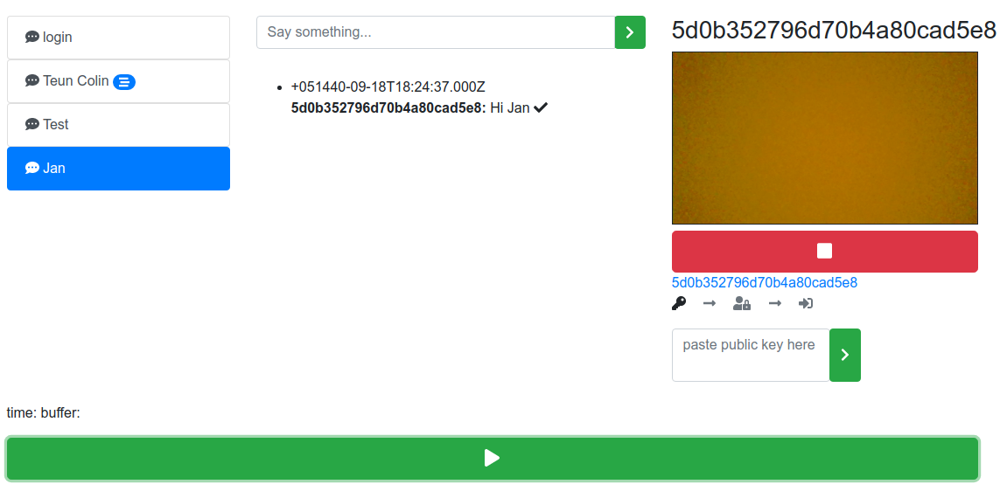

# transpeople


## ToDo
- login request to api
- save keys
- create keys
- use keys to validate messages
- use keys to sighn signitures
- fix 500 ttp error while uploading localVideo
- hide chat input when there are no keys
- hide GoLive when there are no keys 

## Project setup
```
npm install
```

### Compiles and hot-reloads for development
```
npm run serve
```

### Compiles and minifies for production
```
npm run build
```

### Lints and fixes files
```
npm run lint
```
